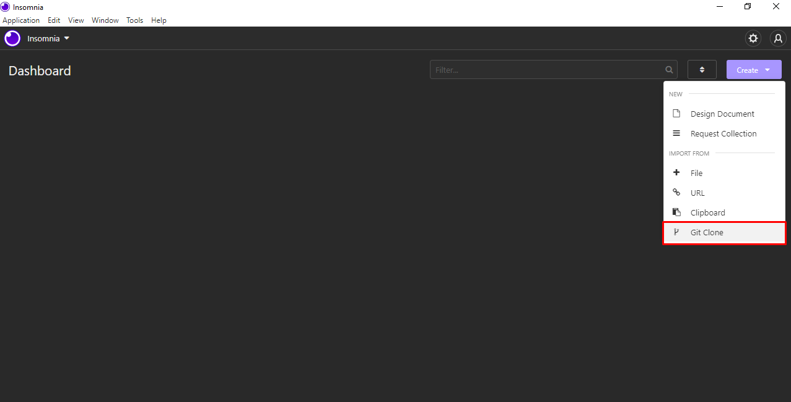
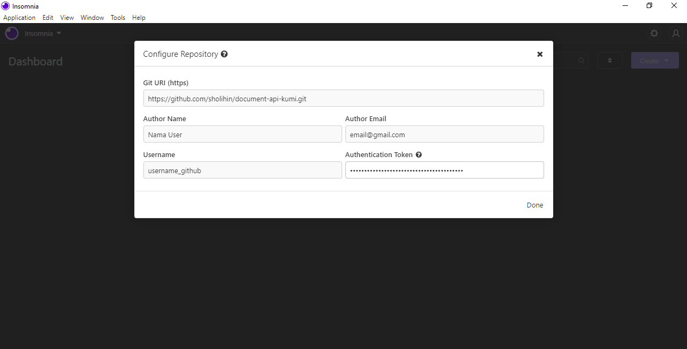
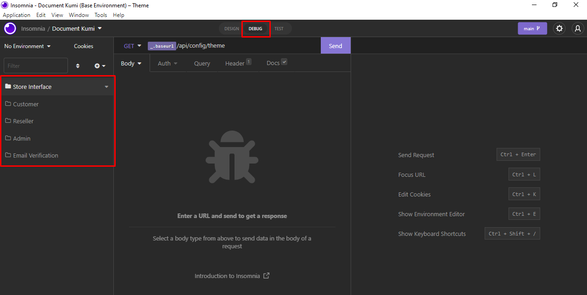

# Document API Kumi

Silahkan Pilih Import Melalui Git Clone, Kemudian Masukkan URL Repository Di Bawah Ini:

Isi Form Dengan Akun Gitlab Anda Dan Masukkan Token Athentication Anda.

Untuk Authentication Token Di Atas, Silahkan Memintanya Langsung Kepada Developer.

