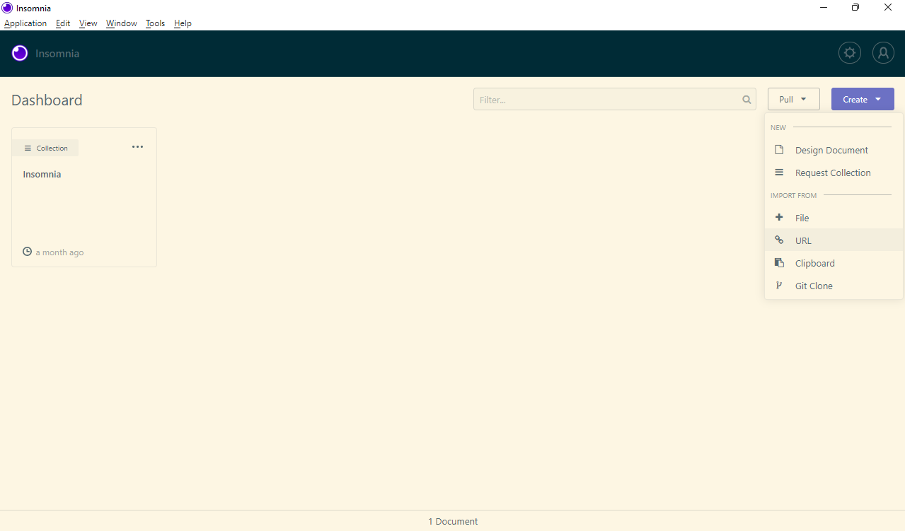
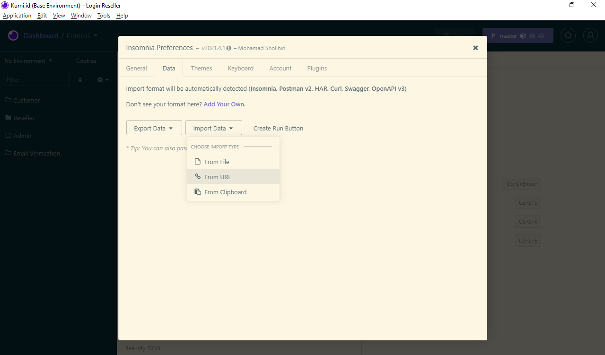

# Document API Kumi

Silahkan Pilih Import Melalui Git Clone, Kemudian Masukkan URL Repository Di Bawah Ini:

```
https://github.com/sholihin/document-api-kumi.git
```




Untuk Authentication Token Di Atas, Silahkan Memintanya Langsung Kepada Developer.


